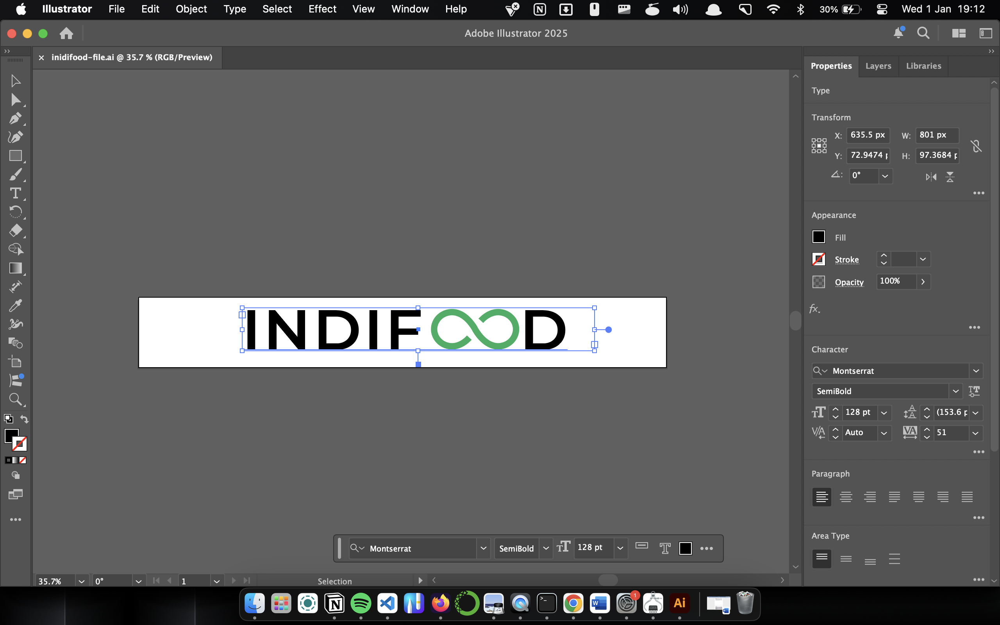
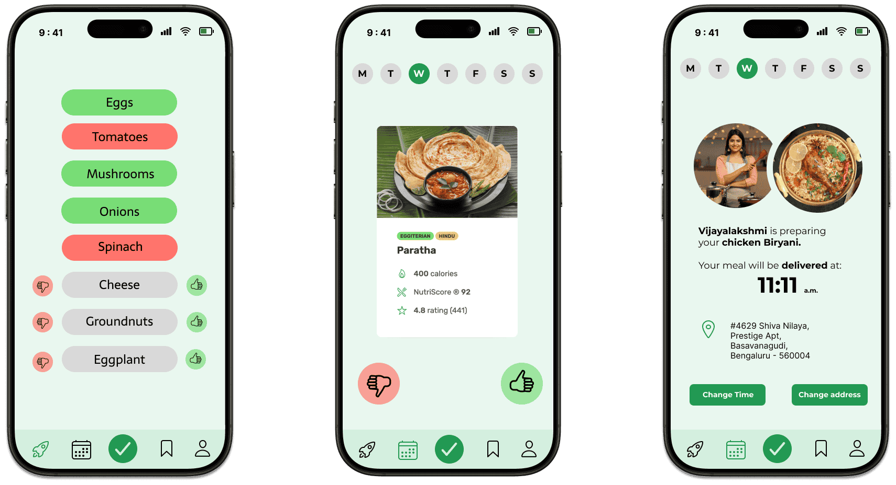

## Project: INDIFOOD - Daily Meal Delivery Website

### Overview:

INDIFOOD is a platform that delivers daily meals to customers, eliminating the need for them to cook. It provides a convenient solution for busy individuals who want fresh and delicious meals delivered to their doorsteps every day.

Deployed at: [indifoodbybharath.netlify.app](https://indifoodbybharath.netlify.app/)

### Skills and Technologies Learned:

 

- **Front-End Development**: Developed the user interface with HTML, CSS, and JavaScript.

- **Semantic HTML**: Gained experience in using meaningful HTML elements for better structure and SEO.

- **Design Fundamentals**: Learned the core principles of design to create a visually appealing and user-friendly interface.

- **Basics of Color Harmony**: Developed an understanding of color schemes and their impact on design aesthetics.

- **Basics of Logo Design**: Learned the fundamentals of creating simple and effective logos.

- **Adobe Illustrator**:
  - Gained hands-on experience in creating graphics and illustrations using Adobe Illustrator.

- **Responsive Design**:
  - Gained hands-on experience in designing and developing responsive websites to ensure seamless functionality across different devices and screen sizes.

**Basics of UI/UX Design**:

- Acquired foundational knowledge and practical experience in creating user-centered designs and intuitive interfaces for enhanced user experience.

**Basics of Figma**:

- Gained a solid understanding of Figma, including its tools and features, to design user-centered interfaces that prioritize usability and enhance user experiences.
  
  

---

### Screenshots

Here is a screenshot of the INDIFOOD website:

Here is a screenshot of the INDIFOOD website's SEO:

---
